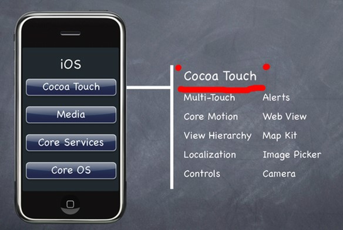
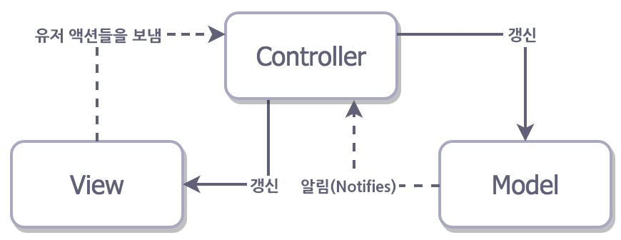

# Cocoa Touch Framework's Design Pattern

## Introduction
* #### Topic
  * Cocoa Touch Framework는 __**어떤 디자인패턴**__ 에 가깝게 구현이 되었을까?

* #### Framework
  * Cocoa Touch Framework의 디자인패턴에 대해 논하기에 앞서 프레임워크에 대한 개념을 알아보았다.

        "소프트웨어의 구체적인 부분에 해당하는 설계와 구현을 재사용이 가능하게끔 일련의 협업화된 형태로 클래스들을 제공하는 것" - 랄프 존슨
  * 덧붙이자면, 프레임워크란 설계의 기반이 되는 부분을 기술한  확장 가능한 기반 코드와
사용자가 이 코드를 자기 입맛대로 확장하는 데 필요한 라이브러리 이 두 가지 요소가 통합되어 제공되는 형태를 말한다.
  * 사용자는 이를 이용해 일정 수준 이상의 품질을 보장받는 코드를, 비교적 빠른 시간에 완성 및 유지 보수할 수 있는 환경을 제공해주는 솔루션으로

        "기본적인 설계나 필요한 라이브러리는 알아서 제공해 줄꺼니깐 넌 그냥 니가 진짜로 하고 싶은 기능 구현에만 전념해!"
  라는 취지에서 만들어진 물건이란 것이다.
* #### Cocoa Touch Framework
  * Cocoa Framework
    * 애플 환경에서 애플리케이션을 제작하기 위한 도구들의 모음
    * Cocoa가 제공하는 도구 중 가장 대표적인 것이 유저 인터페이스(UI)
    * Mac OS X와 iOS의 많은 애플리케이션들이 비슷한 UI를 가지고 있는 이유는 바로 이 Cocoa에서 제공하는 UI 기능들을 사용하기 때문이다.
  * Cocoa Touch Framework
    * Cocoa Framework는 여러 프레임워크들로 이루어져 있는데, 그 중 Cocoa Touch Frmaework는 터치 입력방식을 사용하는 아이폰이나 아이패드를 위한 프레임워크이다.
    * 


## Design Pattern in Cocoa Framework

### MVC-Pattern-like

  * OSX와 iOS 비교 (본문 중)
    ```
    - Model-View-Controller (MVC)
     MVC모델은 코코아 프레임워크의 근간을 이루는 디자인 패턴이다.
     MVC는 모델과 뷰와 컨트롤러를 각각 분리하여 뷰가 변경되거나 모델이 다른 뷰를 이용해야 할 경우에
     Controller만 수정하면 되기 때문에 변경을 국지화 한다.

    XCode에서도 이 MVC가 적용된 것을 알 수 있다.

    - View는 *.xib 파일을 실행하면 Interface Builder가 실행된다.
     View가 코드에서 분리된 것을 알 수 있을 것이다.
     Model과 Controller는 '프로젝트명AppDelegate'이다. 이 부분은 개발자가 Model과 Controller를
     나눠서 프로그램을 개발해야한다. 한마디로 C코드처럼 절차식 언어로 작성하는 것이 아니라 객체지향 언어와
     같이 객체로 구분하여 서로의 역활에 맡게 동작하도록 하라는 것이다.
    ```
  * MVC Pattern에 대한 내용은 이미 다음에 정리하였다. [DesignPattern.md](./DesignPattern.md)
  * 하지만 Cocoa Framework는 전통적인 MVC Pattern과는 다르다. 구조적, 재사용성 등의 문제로 Apple은 MVC를 조금 개선하여 사용하게 되었다.

### Apple's MVC
  * **기대한 Apple's MVC Pattern**
     
           원래 Controller는 Model과 View를 연결시켜주는 역할을 하므로 서로에 대해 알필요가 없다.
           그중에 가장 재사용 불가능한 것이 Controller이며, 우리도 그걸 알고있다. 따라서 우리는 모든
           특이한 로직을 Model이 아닌 Controller에 넣어야한다.
  * **실제 Apple's MVC Pattern**
     

            Cocoa MVC는 View Controller를 덩어리를 작성하도록 만들어버린다. 그 이유는 View들의
            라이프 사이클 안에서 뒤엉키는데 그것들을 분리해내기가 어렵기 때문이라고 말한다. 너가 Model에
            *비지니스 로직이나 데이터 변환같은 것을 없애는 능력을 가졌을 지라도 대부분의 View에서
            반응하면 액션을 Controller로 보내게 될것이다. 뷰 컨트롤러는 결국 모든 것의 델리게이트(delegate)나
            데이터소스(data source)가 될테고, 종종 네트워크 요청과같은 처리도 하고 있을지 모른다.
  * 결국에 [이러한](img/Cocoa_Touch.jpg) 결과를 낳게 된다.

### Conclusion

## 참고자료
* [iOS와 디자인 패턴](http://10apps.tistory.com/153)
* [Introducing iOS Design Patterns in Swift](https://www.raywenderlich.com/86477/introducing-ios-design-patterns-in-swift-part-1)
* [(번역) iOS 아키텍쳐 패턴들](http://blog.canapio.com/43)
* [Cocoa, 그리고 Framework](http://pole2win.tistory.com/entry/Objective-C-cocoa-core-foundation)
* [프레임워크란?](http://jokergt.tistory.com/89)
* [애플 cocoa란 무엇인가??](http://m.blog.naver.com/web4click/110167390575)
* [5 iOS Architectures in 5 minutes](http://slides.com/borlov/arch/fullscreen#/)
* [OSX와 iOS 비교](http://blog.naver.com/PostView.nhn?blogId=huns21&logNo=120193330920&parentCategoryNo=&categoryNo=&viewDate=&isShowPopularPosts=false&from=postView)
