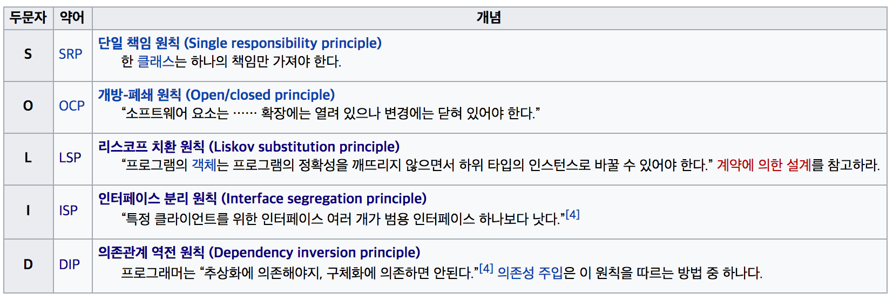

# SOLID

## Introduction
* #### SOLID
  > 컴퓨터 프로그래밍에서 SOLID란 로버트 마틴이 2000년대 초반에 명명한 **객체 지향 프로그래밍 및 설계의 다섯 가지 기본 원칙** 을 마이클 페더스가 두문자어 기억술로 소개한 것이다.
  >
  > 프로그래머가 시간이 지나도 유지 보수와 확장이 쉬운 시스템을 만들고자 할 때 이 원칙들을 함께 적용할 수 있다.
  >
  > SOLID 원칙들은 소프트웨어 작업에서 프로그래머가 소스 코드가 읽기 쉽고 확장하기 쉽게 될 때까지 소프트웨어 소스 코드를 리팩터링하여 코드 냄새를 제거하기 위해 적용할 수 있는 지침이다.
  >
  > 이 원칙들은 애자일 소프트웨어 개발과 적응적 소프트웨어 개발의 전반적 전략의 일부다.


* #### OOP
  > 객체 지향 프로그래밍(Object-Oriented Programming, OOP)은 컴퓨터 프로그래밍의 패러다임의 하나이다.
  >
  > 객체 지향 프로그래밍은 컴퓨터 프로그램을 명령어의 목록으로 보는 시각에서 벗어나 여러 개의 독립된 단위, 즉 "객체"들의 모임으로 파악하고자 하는 것이다.
  >
  > 각각의 객체는 메시지를 주고받고, 데이터를 처리할 수 있다.

  * 특징
    * 자료 추상화
    * 상속
    * 다중 상속
    * 다형성
    * 동적 바인딩

## S : SRP
* #### Single responsibility principle
  * 단일 책임 원칙
    > 한 클래스는 하나의 책임만 가져야 한다.

  *

## O : OCP
* #### Open/closed principle
  * 개방-패쇄 원칙
    > "소프트웨어 요소는 …… 확장에는 열려 있으나 변경에는 닫혀 있어야 한다."

  *

## L : LSP
* #### Liskov substitution principle
  * 리스코프 치환 원칙
    > “프로그램의 객체는 프로그램의 정확성을 깨뜨리지 않으면서 하위 타입의 인스턴스로 바꿀 수 있어야 한다.” 계약에 의한 설계를 참고하라.


* **치환성**(substitutability)은 객체 지향 프로그래밍 원칙이다.
* 컴퓨터 프로그램에서 자료형 **B** 가 자료형 **A** 의 하위형이라면 필요한 프로그램의 속성(정확성, 수행하는 업무 등)의 변경 없이 자료형 **A** 의 객체를 자료형 **B** 의 객체로 교체(치환)할 수 있어야 한다는 원칙이다.
* 집합으로 표현한 예시
  * 
  * 집합 A는 집합 B의 부분집합이므로 집합 A의 원소들은 모두 집합 B에 포함될 것이다.
  * 따라서 자료형 A의 속성들은 자료형 B에도 모두 속해져 있다. (혹은 같은 의미를 가진 속성과 대치된다.)
  * 그러므로 (BaseType)A로 할 수 있는 메소드들을 똑같이 (SubType)B에서도 실행가능하고 같은 결과를 보장해야한다.
* LSP In Swift
  ```swift
  protocol Polygon {
      var area: Float { get }
  }

  class Rectangle: Polygon {

      private let width: Float
      private let length: Float

      init(width: Float, length: Float) {
          self.width = width
          self.length = length
      }

      var area: Float {
          return width * length
      }
  }

  class Square: Polygon {

      private let side: Float

      init(side: Float) {
          self.side = side
      }

      var area: Float {
          return pow(side, 2)
      }
  }

  // Client Method

  func printArea(of polygon: Polygon) {
      print(polygon.area)
  }

  // Usage

  let rectangle = Rectangle(width: 2, length: 5)
  printArea(of: rectangle) // 10

  let square = Square(side: 2)
  printArea(of: square) // 4
  ```
  * Polygon이라는 프로토콜을 사용하여 적용한 예제이다.
  * Square는 한 변의 길이만을 받고 Rectangle은 가로, 세로 길이를 받지만 area라는 메소드를 통하여 같은 결과를 보장해준다.

* 간단히 말하자면 LSP는 확장을 한다면 상위형에서 해주던 책임(약속)을 하위형에서 똑같이 한다고 보장해줘야한다는 원칙이다.

## I : ISP
* Interface segregation principle
  * 인터페이스 분리 원칙
    > “특정 클라이언트를 위한 인터페이스 여러 개가 범용 인터페이스 하나보다 낫다.”

  *

## D : DIP
* Dependency inversion principle
  * 의존관계 역전 법칙
    > 프로그래머는 “추상화에 의존해야지, 구체화에 의존하면 안된다.” 의존성 주입은 이 원칙을 따르는 방법 중 하나다.


## Conclusion
* ### Summary
  * #### ㅇ
    *

## References
* [SOLID - 위키백과](https://ko.wikipedia.org/wiki/SOLID)
* [단일 책임 원칙 - 위키백과](https://ko.wikipedia.org/wiki/%EB%8B%A8%EC%9D%BC_%EC%B1%85%EC%9E%84_%EC%9B%90%EC%B9%99)
* [개방-패쇄 원칙 - 위키백과](https://ko.wikipedia.org/wiki/%EA%B0%9C%EB%B0%A9-%ED%8F%90%EC%87%84_%EC%9B%90%EC%B9%99)
* [리스코프 치환 원칙 - 위키백과](https://ko.wikipedia.org/wiki/%EB%A6%AC%EC%8A%A4%EC%BD%94%ED%94%84_%EC%B9%98%ED%99%98_%EC%9B%90%EC%B9%99)
* [인터페이스 분리 원칙 - 위키백과](https://ko.wikipedia.org/wiki/%EC%9D%B8%ED%84%B0%ED%8E%98%EC%9D%B4%EC%8A%A4_%EB%B6%84%EB%A6%AC_%EC%9B%90%EC%B9%99)
* [의존관계 역전 원칙 - 위키백과](https://ko.wikipedia.org/wiki/%EC%9D%98%EC%A1%B4%EA%B4%80%EA%B3%84_%EC%97%AD%EC%A0%84_%EC%9B%90%EC%B9%99)
* [아론 힐리가스의 iOS 프로그래밍](http://www.kyobobook.co.kr/product/detailViewKor.laf?mallGb=KOR&ejkGb=KOR&barcode=9791186697153)
* [의존성 주입 - 위키백과](https://ko.wikipedia.org/wiki/%EC%9D%98%EC%A1%B4%EC%84%B1_%EC%A3%BC%EC%9E%85)
* [애자일 소프트웨어 개발 - 위키백과](https://ko.wikipedia.org/wiki/%EC%95%A0%EC%9E%90%EC%9D%BC_%EC%86%8C%ED%94%84%ED%8A%B8%EC%9B%A8%EC%96%B4_%EA%B0%9C%EB%B0%9C)
* [객체 지향 프로그래밍 - 위키백과](https://ko.wikipedia.org/wiki/%EA%B0%9D%EC%B2%B4_%EC%A7%80%ED%96%A5_%ED%94%84%EB%A1%9C%EA%B7%B8%EB%9E%98%EB%B0%8D)
* [리스코프 치환 원칙 - Liskov Substitution Principle for Primer](http://vandbt.tistory.com/41)
* [SOLID Principles Applied To Swift](https://marcosantadev.com/solid-principles-applied-swift/)
* [OOP 원칙 SOLID](https://trazy.gitbooks.io/oop/content/oop-srp.html)
