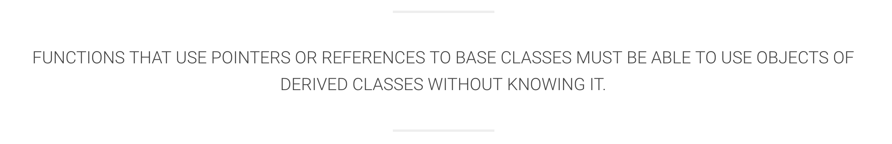

# SOLID

## Introduction

> S - Single Responsibility principle
> : 하나의 클래스는 하나의 책임만 가져야한다.
>
> O - Open/closed principle
> : 소프트웨어 요소는 확장에는 열려있으나, 변경에는 닫혀 있어야 한다.
>
> L - Liskov substitution principle
> : 프로그램의 객체 프로그램의 정확성을 깨뜨리지 않으면서 하위 타입의 인스턴스로 바꿀 수 있어야 한다. 
>
> I  - Interface segregation principle
> : 특정 클라이언트를 위한 인터페이스 여러개가 범용 인터페이스 하나보다 낫다.
>
> D - Dependency inversion principle
> : 프로그래머는 추상화에 의존해야지, 구체화에 의존하면 안된다.
>

* 프로그래머가 시간이 지나도 유지보수와 확장이 쉬운 시스템을 만들고자 할 때 이 원칙들을 함께 적용할 수 있다. 
* 위와 같은 원칙들은 프로그래머가 소스코드가 읽기 쉽고 확장하기 쉽게 될 때까지 소스코드를 리팩터링하여 코드스멜, 즉 코드에서 심오한 문제를 일으킬 가능성이 있는 프로그램 소스코드의 증상을 제거하기 위해 적용할 수 있는 지침이다. 
* #### OOP
  > 객체 지향 프로그래밍(Object-Oriented Programming, OOP)은 컴퓨터 프로그래밍의 패러다임의 하나이다.
  >
  > 객체 지향 프로그래밍은 컴퓨터 프로그램을 명령어의 목록으로 보는 시각에서 벗어나 여러 개의 독립된 단위, 즉 "객체"들의 모임으로 파악하고자 하는 것이다.
  >
  > 각각의 객체는 메시지를 주고받고, 데이터를 처리할 수 있다.

  * 특징
    * 자료 추상화
    * 상속
    * 다중 상속
    * 다형성
    * 동적 바인딩


## S : SRP
## SRP (Single Responsibility Principle

### SRP에서 고려해야할 것
> There Should NEVER be MORE THAN ONE REASON for a CLASS to CHANGE
( 모든 클래스는 하나의 책임만 가지며, 클래스는 그 책임을 완전히 캡슐화 해야한다.)

***캡슐화*** 는
1. 객체의 속성 (data fields)과 행위(methods)를 하나로 묶고,
2. 실제 구현 내용 일부를 외부에 감추어 은닉하는 것이다.

### 예제
> 클래스를 만들거나, 변경할 때마다 자문해라!
> 이 클래스는 몇개의 책임을 가지고 있는가?

```swift
class Handler {
 
    func handle() {
        let data = requestDataToAPI()
        let array = parse(data: data)
        saveToDB(array: array)
    }
 
    private func requestDataToAPI() -> Data {
        // send API request and wait the response
    }
 
    private func parse(data: Data) -> [String] {
        // parse the data and create the array
    }
 
    private func saveToDB(array: [String]) {
        // save the array in a database (CoreData/Realm/...)
    }
}
```

Handler라는 클래스는의 메소드를 살펴보자.
(1) data 상수에 API 에서 받아온 데이터를 저장한다.
(2) API의 응답(데이터)를 파싱하고 배열을 만든다.
(3) 데이터베이스에 배열을 저장한다.

=======

### SRP에서 고려해야할 것
> There Should NEVER be MORE THAN ONE REASON for a CLASS to CHANGE
( 모든 클래스는 하나의 책임만 가지며, 클래스는 그 책임을 완전히 캡슐화 해야한다.)

***캡슐화*** 는
1. 객체의 속성 (data fields)과 행위(methods)를 하나로 묶고,
2. 실제 구현 내용 일부를 외부에 감추어 은닉하는 것이다.

### 예제
> 클래스를 만들거나, 변경할 때마다 자문해라!
> 이 클래스는 몇개의 책임을 가지고 있는가?

```swift
class Handler {
 
    func handle() {
        let data = requestDataToAPI()
        let array = parse(data: data)
        saveToDB(array: array)
    }
 
    private func requestDataToAPI() -> Data {
        // send API request and wait the response
    }
 
    private func parse(data: Data) -> [String] {
        // parse the data and create the array
    }
 
    private func saveToDB(array: [String]) {
        // save the array in a database (CoreData/Realm/...)
    }
}
```

Handler라는 클래스는의 메소드를 살펴보자.
(1) data 상수에 API 에서 받아온 데이터를 저장한다.
(2) API의 응답(데이터)를 파싱하고 배열을 만든다.
(3) 데이터베이스에 배열을 저장한다.

하나의 클래스가 여러개의 책임을 가지고 있는 것을 확인할 수 있다.
이를 아래와 같이 책임들을 작은 클래스들로 쪼개서 옮김으로써 해결할 수 있다.


```swift
class Handler {
 
    let apiHandler: APIHandler
    let parseHandler: ParseHandler
    let dbHandler: DBHandler
 
    init(apiHandler: APIHandler, parseHandler: ParseHandler, dbHandler: DBHandler) {
        self.apiHandler = apiHandler
        self.parseHandler = parseHandler
        self.dbHandler = dbHandler
    }
 
    func handle() {
        let data = apiHandler.requestDataToAPI()
        let array = parseHandler.parse(data: data)
        dbHandler.saveToDB(array: array)
    }
}
 
class APIHandler {
 
    func requestDataToAPI() -> Data {
        // send API request and wait the response
    }
}
 
class ParseHandler {
 
    func parse(data: Data) -> [String] {
        // parse the data and create the array
    }
}
 
class DBHandler {
 
    func saveToDB(array: [String]) {
        // save the array in a database (CoreData/Realm/...)
    }
}
```

이렇게 SRP를 고려함으로서 클래스들을 가장 깔끔하게 유지할 수 있다. 
더불어  변경전의 코드 예제에서는 `requestDataToAPI`, `parse`, `saveTODB` 와 같은 메소드들을 바로 테스트할 수 없다. 
각각이 전부 private 메소드로 구현되어져있고, private으로 구현된 메소드는 자기 클래스 내부의 메소드에서만 접근이 가능하기 때문이다. 
즉, Handler의 객체를 만들더라도 각각의 메소드를 떼어서 테스트할 수가 없다. 

그러나, SRP를 고려하여 래팩토링을 거친 후에는, `APIHander`,  `ParseHandler`,  `DBHandler` 클래스 들을 통해 쉽게 테스트를 할 수 있다. 
  
  
  

## O : OCP
* #### Open/closed principle
  * 개방-패쇄 원칙
    > "소프트웨어 요소는 …… 확장에는 열려 있으나 변경에는 닫혀 있어야 한다."

  * "확장에는 열려있으나"
    * 요구사항이 변경되거나 추가사항이 발생하더라도 쉽게 기존 구성요소를 쉽게 확장하여 사용할 수 있어야 한다.

  * "변경에는 닫혀있어야 한다."
    * 요구사항이 변경되거나 추가사항이 발생하더라도 기존 구성 요소에서는 수정이 일어나서는 안된다.

* ### 예시
  예시 1

*  Class Car의 세부 정보를 출력하는 Logger 라는 클레스가 있다고 하자 그 코드는 아래와 같이 정의 되어있다.

```swift
class Logger {

    func printData() {
        let cars = [
            Car(name: "Batmobile", color: "Black"),
            Car(name: "SuperCar", color: "Gold"),
            Car(name: "FamilyCar", color: "Grey")
        ]

        cars.forEach { car in
            print(car.printDetails())
        }
    }
}
class Car {
    let name: String
    let color: String

    init(name: String, color: String) {
        self.name = name
        self.color = color
    }

    func printDetails() -> String {
        return "I'm \(name) and my color is \(color)"
    }
}
```
  * 만약 새로운 종류의 탈것인 Bicycle도 새롭게 Logger에서 표시하고 싶다고 하자 이 경우 아래의 코드 처럼 된다. 즉, 새롭게 출력을 해주고 싶을때 마다 Logger를 수정해주어야 한다. (OCP를 위반)

```swift
class Logger {

    func printData() {
        let cars = [
            Car(name: "Batmobile", color: "Black"),
            Car(name: "SuperCar", color: "Gold"),
            Car(name: "FamilyCar", color: "Grey")
        ]

        cars.forEach { car in
            print(car.printDetails())
        }

        let bicycles = [
            Bicycle(type: "BMX"),
            Bicycle(type: "Tandem")
        ]

        bicycles.forEach { bicycles in
            print(bicycles.printDetails())
        }
    }
}

class Car {
    let name: String
    let color: String

    init(name: String, color: String) {
        self.name = name
        self.color = color
    }

    func printDetails() -> String {
        return "I'm \(name) and my color is \(color)"
    }
}

class Bicycle {
    let type: String

    init(type: String) {
        self.type = type
    }

    func printDetails() -> String {
        return "I'm a \(type)"
    }
}
```
* 이런 문제를 해결하기 위해서는 프로토콜을 사용하면 된다. 탈 것의 클래스들이 `Printable` 이라는 프로토콜을 준수하도록 하여, 기존의 Logger에 큰 변화를 주지 않고 각 내용들을 출력해 줄 수 있다.

```swift
protocol Printable {
    func printDetails() -> String
}

class Logger {

    func printData() {
        let cars: [Printable] = [
            Car(name: "Batmobile", color: "Black"),
            Car(name: "SuperCar", color: "Gold"),
            Car(name: "FamilyCar", color: "Grey"),
            Bicycle(type: "BMX"),
            Bicycle(type: "Tandem")
        ]

        cars.forEach { car in
            print(car.printDetails())
        }
    }
}

class Car: Printable {
    let name: String
    let color: String

    init(name: String, color: String) {
        self.name = name
        self.color = color
    }

    func printDetails() -> String {
        return "I'm \(name) and my color is \(color)"
    }
}

class Bicycle: Printable {
    let type: String

    init(type: String) {
        self.type = type
    }

    func printDetails() -> String {
        return "I'm a \(type)"
    }
}


```


  #### 예시 2
> 스타크래프트의 유닛을 만든다고 치자.
>
> 당신은 이런저런 공통사항을 생각하며 메소드와 필드를 정의한다.
이중엔 이동 메소드도 있다.
이동 메소드는 대상 위치를 인수로 받아 속도에 따라 대상 위치까지 유닛을 길찾기 인공지능을 사용해 이동한다.
>
> 하지만 잠깐 곰곰히 생각해보니 이러면 브루들링같은 유닛의 기묘한 움직임을 구현할때 애로사항이 생길 수 있다. 고민하다가 이동 함수에서 이동 패턴을 나타내는 함수(혹은 클래스)를 분리해서 구현을 하위 클래스에 맡긴다.
>
> 그러면 부르들링 클래스에선 이것만 재정의/설정하면 유닛 클래스의 변경 없이 색다른 움직임을 보여줄수 있다!
>
> 이 '유닛'클래스의 '이동' 메소드를 수정할 필요가 없다(수정에 대해선 폐쇄).
>
> 그냥 브루들링 클래스의 이동 패턴만 재정의하면 된다(확장에 대해선 개방).

## L : LSP
* #### Liskov substitution principle
  * 리스코프 치환 원칙
    > “프로그램의 객체는 프로그램의 정확성을 깨뜨리지 않으면서 하위 타입의 인스턴스로 바꿀 수 있어야 한다.” 계약에 의한 설계를 참고하라.


* **치환성**(substitutability)은 객체 지향 프로그래밍 원칙이다.
* 컴퓨터 프로그램에서 자료형 **B** 가 자료형 **A** 의 하위형이라면 필요한 프로그램의 속성(정확성, 수행하는 업무 등)의 변경 없이 자료형 **A** 의 객체를 자료형 **B** 의 객체로 교체(치환)할 수 있어야 한다는 원칙이다.
* 집합으로 표현한 예시
  * 
  * 집합 A는 집합 B의 부분집합이므로 집합 A의 원소들은 모두 집합 B에 포함될 것이다.
  * 따라서 자료형 A의 속성들은 자료형 B에도 모두 속해져 있다. (혹은 같은 의미를 가진 속성과 대치된다.)
  * 그러므로 (BaseType)A로 할 수 있는 메소드들을 똑같이 (SubType)B에서도 실행가능하고 같은 결과를 보장해야한다.
* LSP In Swift
  ```swift
  protocol Polygon {
      var area: Float { get }
  }

  class Rectangle: Polygon {

      private let width: Float
      private let length: Float

      init(width: Float, length: Float) {
          self.width = width
          self.length = length
      }

      var area: Float {
          return width * length
      }
  }

  class Square: Polygon {

      private let side: Float

      init(side: Float) {
          self.side = side
      }

      var area: Float {
          return pow(side, 2)
      }
  }

  // Client Method

  func printArea(of polygon: Polygon) {
      print(polygon.area)
  }

  // Usage

  let rectangle = Rectangle(width: 2, length: 5)
  printArea(of: rectangle) // 10

  let square = Square(side: 2)
  printArea(of: square) // 4
  ```
  * Polygon이라는 프로토콜을 사용하여 적용한 예제이다.
  * Square는 한 변의 길이만을 받고 Rectangle은 가로, 세로 길이를 받지만 area라는 메소드를 통하여 같은 결과를 보장해준다.

* 간단히 말하자면 LSP는 확장을 한다면 상위형에서 해주던 책임(약속)을 하위형에서 똑같이 한다고 보장해줘야한다는 원칙이다.

## I : ISP
* Interface segregation principle
  * 인터페이스 분리 원칙
    > “특정 클라이언트를 위한 인터페이스 여러 개가 범용 인터페이스 하나보다 낫다.”

  * 정의
    > 인터페이스 분리 원칙은 큰 덩어리의 인터페이스를 구체적이고 작은 단위의 인터페이스로 분리시켜야 한다는 원칙입니다.
    >
    > 이와 같은 작은 단위들을 역할 인터페이스라고 부릅니다.
    >
    > 인터페이스 분리 원칙은 시스템의 내부 의존성을 약화시켜 리팩토링, 수정, 재패보를 보다 쉽게 할 수 있습니다.

  * 프로토콜
    > Swift에서 프로토콜은 OOP에서의 인터페이스의 역할을 합니다.
    >
    > 프로토콜의 특징은 다음과 같습니다.

      * 특정 역할을 수행하기 위한 메소드, 프로퍼티, 기타 요구사항 등의 청사진이다.

      * 프로토콜을 채틱한 타입은 프로토콜이 요구한 기능을 수행하여 프로토콜을 준수해야한다.

      * 다중 상속이 가능하다.


  * Swift에서의 ISP 적용

    > 우선 큰 덩어리의 Protocol을 구현해봅시다.

    ```
    protocol ActionProtocol {
        func didWalk()
        func didRun()
        func didSwim()
    }
    ```

    > 이후 클래스에 특정 메소드를 사용하고자 하면 다음과 같이 구현하면 됩니다.

    ```
    class ActionClass: ActionProtocol {
      func didWalk() {
        // Walk Action
      }

      func didRun() {
        // Run Action
      }

      func didSwim() {
        // Swim Action
      }
    }
    ```

    > 위의 코드의 문제점은 수영을 위한 메소드만이 필요한 경우에도 필요 없는 메소드까지 구현해줘야 한다는 점입니다.
    >
    > 이와 같은 문제점을 해결하기 위해 다음과 같이 구현해줍시다.

    ```
    protocol WalkProtocol {
      func didWalk()
    }

    protocol RunProtocol {
      func didRun()
    }

    protocol SwimProtocol {
      func didSwim()
    }

    class ActionClass: WalkProtocol, RunProtocol, SwimProtocol {
      func didWalk() {
        // Walk Action
      }

      func didRun() {
        // Run Action
      }

      func didSwim() {
        // Swim Action
      }
    }

    class SwimAction: SwimProtocol {
      func didSwim() {
        // Swim Action
      }
    }
    ```

## D : DIP
# The Dependency Inversion Principle

***A. High level modules should not depend upon low level modules. Both should depend upon abstractions.***

***하이 레벨 모듈은 로우레벨 모듈에 의존해서는 안된다. 둘 다 추상에 의존해야 한다.***

***B. Abstractions should not depend upon details. Details should depend upon abstractions.***

***추상은 상세를 의존해서는 안된다. 상세는 추상을 의존해야 한다.***

DIP는 재사용성을 위한 중요한 원칙이다. DIP는 OCP(Open-Closed Principle)과 비슷한 접근을 가진다. 깨끗한 구조를 가지기 위해서는 의존성을 해제해야 한다.

```swift
class Handler {
  let fm = FilesystemManager()

  func handle(string: String) {
    fm.save(string: String)
  }
}

class FilesystemManager {
  func save(string: String) {
    
  }
}
```

FilesystemManager 클래스는 로우 레벨의 모듈로 다른 프로젝트에서 재사용하기 매우 편리하다. 문제는 하이 레벨 모듈인 Handler이다. Handler는 FilesystemManager와 강하게 결합되어 있기 때문에 재사용성이 좋지 않다. 

여기서 의존성을 해제하기 위해 Storage 프로토콜을 사용할 수 있다. 이 방법에서 Handler는 이 abstract protocol을 사용하여 어떤 종류의 storage든 사용할 수 있게 된다. 이렇게 접근하면 우리는 쉽게 filesystem을 교쳉할 수 있다.

```swift
class Handler {
  let storage: Storage

  init(storage: Storage) {
    self.storaga
  }

  func handle(string: String) {
    storage.save(string: string)
  }
}

protocol Storage {
  func save(string: String)
}

class FilesystemManager: Storage {
  func save(string: String) {
    // Save file
  }
}

class DatabaseManager: Storage {
  func save(string: String) {

  }
}
```

이 원칙은 테스팅에도 매우 유용하다. 우리는 쉽게 Storage 프로토콜을 구현한 클래스를 사용하고 테스팅 할 수 있다.

```swift
class StubStorage: Storage {
  var isSavedCalled = false

  func save(string: String) {
    isSavedCalled = true
  }
}

class HandlerTests {
  func test_Handle_IsSaveCalled() {
    let handler = Handler()
    let stubStorage = StubStorage()

    handler.handle(string: "test", storage: stubStorage)

    XCTAssertTrue(stubStorage.isSavedCalled)
  }
}
```


## Conclusion
* ### Summary
  * #### ㅇ
    *

## References
* [SOLID - 위키백과](https://ko.wikipedia.org/wiki/SOLID)
* [단일 책임 원칙 - 위키백과](https://ko.wikipedia.org/wiki/%EB%8B%A8%EC%9D%BC_%EC%B1%85%EC%9E%84_%EC%9B%90%EC%B9%99)
* [개방-패쇄 원칙 - 위키백과](https://ko.wikipedia.org/wiki/%EA%B0%9C%EB%B0%A9-%ED%8F%90%EC%87%84_%EC%9B%90%EC%B9%99)
* [리스코프 치환 원칙 - 위키백과](https://ko.wikipedia.org/wiki/%EB%A6%AC%EC%8A%A4%EC%BD%94%ED%94%84_%EC%B9%98%ED%99%98_%EC%9B%90%EC%B9%99)
* [인터페이스 분리 원칙 - 위키백과](https://ko.wikipedia.org/wiki/%EC%9D%B8%ED%84%B0%ED%8E%98%EC%9D%B4%EC%8A%A4_%EB%B6%84%EB%A6%AC_%EC%9B%90%EC%B9%99)
* [의존관계 역전 원칙 - 위키백과](https://ko.wikipedia.org/wiki/%EC%9D%98%EC%A1%B4%EA%B4%80%EA%B3%84_%EC%97%AD%EC%A0%84_%EC%9B%90%EC%B9%99)
* [아론 힐리가스의 iOS 프로그래밍](http://www.kyobobook.co.kr/product/detailViewKor.laf?mallGb=KOR&ejkGb=KOR&barcode=9791186697153)
* [의존성 주입 - 위키백과](https://ko.wikipedia.org/wiki/%EC%9D%98%EC%A1%B4%EC%84%B1_%EC%A3%BC%EC%9E%85)
* [애자일 소프트웨어 개발 - 위키백과](https://ko.wikipedia.org/wiki/%EC%95%A0%EC%9E%90%EC%9D%BC_%EC%86%8C%ED%94%84%ED%8A%B8%EC%9B%A8%EC%96%B4_%EA%B0%9C%EB%B0%9C)
* [객체 지향 프로그래밍 - 위키백과](https://ko.wikipedia.org/wiki/%EA%B0%9D%EC%B2%B4_%EC%A7%80%ED%96%A5_%ED%94%84%EB%A1%9C%EA%B7%B8%EB%9E%98%EB%B0%8D)
* [리스코프 치환 원칙 - Liskov Substitution Principle for Primer](http://vandbt.tistory.com/41)
* [SOLID Principles Applied To Swift](https://marcosantadev.com/solid-principles-applied-swift/)
* [OOP 원칙 SOLID](https://trazy.gitbooks.io/oop/content/oop-srp.html)
