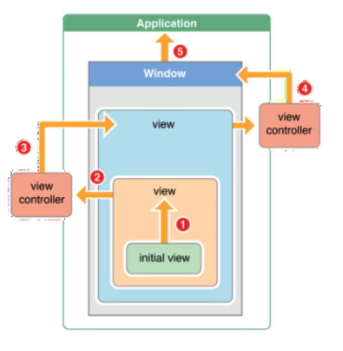

# 두 단계 초기화 패턴 & 응답 체인 패턴

## 두 단계 초기화 패턴
* Two-Phase Initialization

### 객체 중심 언어에서의 초기화
* 객체가 기본이 되는 객체 중심 언어에서는 **생성자와 객체 초기화가 매우 중요하다.**
* #### 안전한 객체
  * 객체 인스턴스 메모리 할당 검증
  * 객체 내부 리소스를 초기화
* 안전한 객체를 사용함으로써 안전한 프로그램을 설계할 수 있다.


### 초기화 과정
* 코코아 프레임워크의 객체들을 포함해서 NSObject에서 상속받은 모든 클래스의 인스턴스가 만들어지기까지는 두 단계(two-phase)에 걸쳐서 초기화가 이루어진다.

* 1 단계 : 메모리 공간 할당
  * 해당 클래스에 alloc 메시지를 보내서 힙 공간에 객체 인스턴스 메모리 공간을 할당한다.
* 2 단계 : Initialization
  * 객체 인스턴스에 init 메시지를 보내서 객체 인스턴스 속성, 내부에 필요한 객체나 값을 초기화한다.
* Objective-C 예시
  ```c
  Pen *aPen = [[Pen alloc] init];
  ```
  * Pen 클래스에 alloc 메시지를 보내고 init을 호출하는 두 단계를 거친다.
* > Swift의 두 단계 이니셜라이저 과정은 Objective-C의 초기화와 유사하다. 주된 차이점이라면 일 단계에서 Objective-C는 0또는 nil 값을 모든 속성에 할당하는데, Swift의 초기화 과정은 사용자 초기 값을 설정하도록 하게 하여 더 유연해지며, 0 또는 nil이 기본 값으로 유효하지 않은 타입에 대처할 수 있다.

### 지정 초기화 메서드
* Designated Initializer
* 클래스의 주 이니셜라이저는 지정 이니셜라이저로, 클래스의 모든 속성을 완전히 초기화한다. 적합한 슈퍼클래스 이니셜라이저를 호출하여 초기화 과정을 부모클래스로 연쇄하도록 한다.
* 모든 클래스는 하나 이상의 지정 이니셜라이저를 가진다. 지정 이니셜라이저는 깔때기를 통해 초기화 과정의 연쇄를 슈퍼클래스로 진행시킨다.
* Swift Code
  ```swift
  init(parameters) {
    statements
  }
  ```

### 편의 초기화 메서드
* Convenience Initializer
* 편의 이니셜라이저는 호출하는 지정 이니셜라이저 인자에 기본 값으로 설정할 수 있다. 또한 특정 쓰임새나 입력 값 타입을 위한 클래스의 인스턴스를 생성하기 위해 편의 이니셜라이저를 정의할 수 있다.
* 만약 클래스에 편의 이니셜라이저를 쓸 필요가 없다면 사용하지 않아도 된다. 일반적인 이니셜라이저 패턴을 단축할 때 만든 편의 이니셜라이저는 시간을 단축시키거나 클래스의 이니셜라이저 의도를 명확하게 만들 수 있다.
* Swift Code
  ```swift
  convenience init(parameters) {
    statements
  }
  ```

### 네 가지 원칙
* 1. 지정 이니셜라이저는 클래스에 도입된 모든 속성이 슈퍼클래스 이니셜라이저에 위임되기 전에 초기화되는지 확실하게 해야한다.
    * 객체를 위한 메모리는 저장 속성의 초기 상태가 알려져야 완전히 초기화 되었다고 간주한다. 이 규칙에 만족하기 위해선 지정 이니셜라이저는 모든 클래스의 자기 속성이 연쇄를 위로 올리기 전에 초기화되어야 한다.

* 2. 지정 이니셜라이저는 상속받은 속성에 값을 할당하기 전에 슈퍼 클래스 이니셜라이저로 위임해야 한다. 그렇지 않으면 지정 이니셜라이저에 새로운 값은 슈퍼클래스의 초기화로부터 덮어씌여질 것이다.

* 3. 편의 이니셜라이저는 특정 속성에 값을 할당하기 전에 다른 이니셜라이저에 위임해야 하며, 같은 클래스에 정의된 속성을 포함해야 한다. 그렇지 않으면 클래스의 지정 이니셜라이저에 의해 편의 이니셜라이저의 새로운 값이 덮어씌여질 것이다.

* 4. 이니셜라이저는 인스턴스 메소드를 호출할 수 없으며 인스턴스 속성의 값을 읽을 수 있거나 초기화 첫 단계가 완료될 때까지 값으로 self로 참조한다.

* 클래스 인스턴스는 일 단계가 끝나기 전까지 완전히 유효하지 않다. 속성은 접근만 가능하고 메소드는 호출만 가능하다면 클래스 인스턴스는 일단계가 끝나며 유효하게 된다.

### 초기화 연쇄
* Initializer Chaining
* 지정 이니셜라이저와 편의 이니셜라이저의 관계를 간단하게 하기 위해 Swift는 다음 세가지 규칙을 적용하였다.
  * 규칙 1. 지정 이니셜라이저는 직접 관련있는 슈퍼클래스로부터 지정 이니셜라이저를 호출해야 한다.
  * 규칙 2. 편의 이니셜라이저는 같은 클래스에서 다른 이니셜라이저 호출해야 한다.
  * 규칙 3. 편의 이니셜라이저는 지정 이니셜라이저로 끝맺어야 한다.

* 요약
  * 지정 이니셜라이저는 항상 위로 위임을 한다.
  * 편의 이니셜라이저는 항상 가로질러 위임한다.

* 자세한 데모 코드는 [여기](https://github.com/SamStone92/DesignPatternsInSwift/blob/master/)에...

--------

## 예제 코드
```swift
class SuperDada {
    var superProp: Int
    
    // 가장 최상위 계층의 이니셜라이저가 완료된 시점이 Phase 1
    init(superProp: Int) {
        self.superProp = superProp
    }
}

class SubDada: SuperDada {
    var subProp: Int
    
    init(subProp: Int) {
        // 슈퍼클래스에 초기화 연쇄를 위로 전달하기 전에 해당 객체의 속성을 초기화 하는걸 보장해야한다.
        // 객체의 메모리는 해당 객체의 stored 프로퍼티가 전부 초기화 되어야만 초기화 되었다고 간주한다.
        
        // 규칙 1: 지정 이니셜라이저는 클래스에 도입된 모든 속성이 슈퍼클래스 이니셜라이저에 위임되기 전에 초기화되는지 확실하게 해야한다.
        // 자신의 프로퍼티를 Phase 1에서 초기화 하지 않고 Phase 2에서 값을 초기화하면 값이 예상하지 못한 값으로 초기화 될 수 있다.
        self.subProp = subProp
        super.init(superProp: subProp)
        
        // 아래는 Phase 2단계에서 수행된다. 상위 클래스의 값을 수정할 수도 있고 자신의 메소드도 사용가능하다.
        // Phase1에서 규칙1번이 없어서 자신의 프로퍼티를 super.init 후에 지정하게 된다면 의도하지 않은 값이 지정될 수 있다.
        self.modifySelf(a: 5)

        // 규칙 2. 지정 이니셜라이저는 상속받은 속성에 값을 할당하기 전에 슈퍼 클래스 이니셜라이저로 위임해야 한다. 그렇지 않으면 지정 이니셜라이저에 새로운 값은 슈퍼클래스의 초기화로부터 덮어씌여질 것이다.
        self.superProp = 5
    }
    
    func modifySelf(a: Int) {
        self.subProp = a
    }
}

class SubSubDada: SubDada {
    var subsubProp: Int
    
    init(subsubProp: Int) {
        self.subsubProp = subsubProp
        
        super.init(subProp: 5)
        
        self.subProp = 5
    }
}
```

Phase1에서 규칙1번이 없어서 자신의 프로퍼티를 super.init 후에 지정하게 됬을 때 문제가 생기는 경우
```swift
class SubDada: SuperDada {
    var subProp: Int
    
    init(subProp: Int) {
        
        super.init(superProp: subProp)

        // 자신의 프로퍼티를 super.init후에 실행하여 값 5를 의도했으나 다른 값으로 초기화 된다.
        self.modifySelf(a: 5)
        self.subProp = subProp

        self.superProp = 5
    }
    
    func modifySelf(a: Int) {
        self.subProp = a
    }
}
```

## 응답 체인 패턴
* Chain of Responsibility  
> 객체 지향 디자인에서 chain-of-responsibility pattern은 명령 객체와 일련의 처리 객체를 포함하는 디자인 패턴이다. 각각의 처리 객체는 명령 객체를 처리할 수 있는 연산의 집합이고, 체인 안의 처리 객체가 핸들할 수 없는 명령은 다음 처리 객체로 넘겨진다. 이 작동방식은 새로운 처리 객체부터 체인의 끝까지 다시 반복된다.
>
> 표준 책임 연쇄 모델이 변화하면서, 어떤 처리 방식에서는 다양한 방향으로 명령을 보내 책임을 트리 형태로 바꾸는 관제사 역할을 하기도 한다. 몇몇 경우에서는, 처리 객체가 상위의 처리 객체와 명령을 호출하여 작은 파트의 문제를 해결하기 위해 재귀적으로 실행된다. 이 경우 재귀는 명령이 처리되거나 모든 트리가 탐색될때까지 진행되게 된다. XML(파싱되었으나 실행되지 않은) 인터프리터가 한 예이다.
>
> 이 패턴은 결합을 느슨하게 하기 위해 고안되었으며 가장 좋은 프로그래밍 사례로 꼽힌다.

* Main idea :
  * 메시지에 따라 응답 객체를 직접 지정 혹은 바인딩하여 결합성을 올리지 않고 **응답할 가능성이 있는 객체들** 을 반복 확인한다.

- UIApplication  객체 : app event queue에 들어온 이벤트를 처리한다.


#### 어플리케이션이 받는 event
- UIControl Actions : Action, target pattern을 사용하여 등록된 action
- User event : touch, shake 등 유저가 발생시킨 이벤트
- System events : low memory, rotation 등의 이벤트

#### UIControl Actions

touch가 아닌 Action

> application이 first responder에게 호출을 전달하고, first responder가 system을 처리하지 못하면 responder-chain을 따라 적절한 responder를 찾는다.

touch Action

> system touch 감지

> -> Application

> -> _touchesEvent  내부 메소드에서 touch event  이벤트를 받는다

> -> 이 이벤트를 sendEvent를 사용하여 UIWindow에 전달

> -> hit tes 진행(touch가 뷰의 범위내에 있는지 확인)

> -> 이 hit test는 최상위 뷰에 도달할때 가지 계속적으로 호출된다.

> 마지막 최상위 뷰에 윈도우가 이벤트를 보낸다


#### 이벤트를 받은 경우 처리 방법 3가지
1. 뷰가 이벤트에 해당하는 메소드를 구현하지 않으면 다음 responder에 전달.
2. 이벤트를 받아 처리하고 superview가 이 이벤트를 받을 수 있도록 super를 호출
3. 위의 메소드를 받고 다음 reponder이 처리 못하도록 한다.



## References
* [[Swift]Initialization 정리](http://minsone.github.io/mac/ios/swift-initialization-summary)
* [Cocoa 와 Cocoa touch responder chain 이해하기
](https://medium.com/@audrl1010/cocoa-%EC%99%80-cocoa-touch-responder-chain%EC%97%90-%EC%9D%B4%ED%95%B4%ED%95%98%EA%B8%B0-5121d8d707d2)

* [Apple - The Swift Programming Language (Swift 4) - Initialization](https://developer.apple.com/library/content/documentation/Swift/Conceptual/Swift_Programming_Language/Initialization.html)
* [Phase 1 and Phase 2 initialization in Swift - StackOverflow](https://stackoverflow.com/questions/29230467/phase-1-and-phase-2-initialization-in-swift)
* [Design Patterns in Swift: Chain of Responsibility Pattern](https://medium.com/design-patterns-in-swift/design-patterns-in-swift-chain-of-responsibility-pattern-f575c85a43c)
* [DesignPatternsInSwift - Github](https://github.com/SamStone92/DesignPatternsInSwift)
* [책임 연쇄 패턴 - 위키백과](https://ko.wikipedia.org/wiki/%EC%B1%85%EC%9E%84_%EC%97%B0%EC%87%84_%ED%8C%A8%ED%84%B4)
* [Follow the Chain of Responsibility](http://www.javaworld.com/article/2073684/java-web-development/follow-the-chain-of-responsibility.html)
* [Swifty Responder Chain](http://roopc.net/posts/2016/swifty-responder-chain/)
