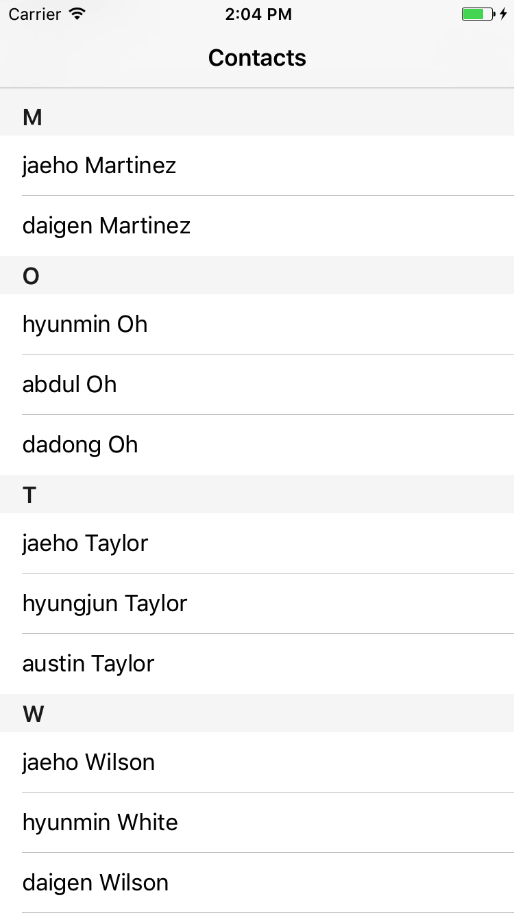

## 모둠활동 과제

### Contacts 목록 화면 만들기


* 연락처는 Last name, First name 알파벳으로만 구성되있습니다.
* 각 연락처는 Last name의 첫 알파벳의 대문자에 해당하는 섹션에 포함됩니다.
* 섹션은 A~Z 26개 또는 해당 섹션에 연락처가 없을 경우 그 이하가 될 수 있습니다.

### 연락처 랜덤 생성
```swift
convenience init(random: Bool = false) {
        if random {
            var randomFirstNames: [String] = ["dadong", "jaeho", "hyungjun", "hyunmin", "daigen", "aaron", "abdul", "austin", "jack", "justin", "codie"]
            var randomLastNames: [String] = ["Kim", "Jung", "Park", "Oh", "Sohn", "Lee", "Ryu", "Smith", "Adams", "White", "Harris", "Martin", "Gracia", "Martinez", "Robinson", "Clark", "Wilson", "Jones", "Taylor", "Gray", "King", "Baker", "Carter" ,"Perez"]
            
            let randomFirstName = randomFirstNames[Int(arc4random_uniform(UInt32(randomFirstNames.count-1)))]
            let randomLastName = randomLastNames[Int(arc4random_uniform(UInt32(randomLastNames.count-1)))]
            
            self.init(firstName: randomFirstName, lastName: randomLastName)
        } else {
            self.init(firstName: "", lastName: "")
        }
    }
```

### 예시

