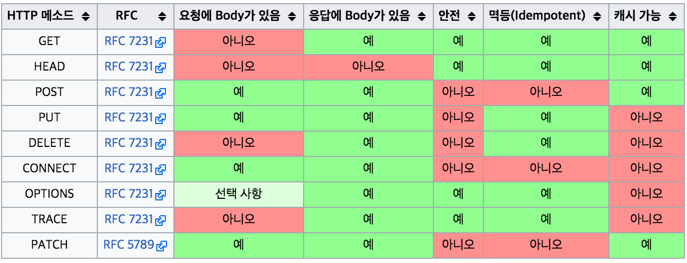

## HTTP

* HTTP(HyperText Transfer Protocol)는 WWW 상에서 클라이언트와 서버 사이에 이루어지는 요청/응답(request/response) 프로토콜.
* TCP와 UDP를 통하여 80번 포트를 사용.

* ### Methods



* ### HTTP Message

  * ASCII로 인코딩된 텍스트 정보로 구성되며, 여러 줄에 걸쳐 만들어진다.
  * HTTP/1.1과 프로토콜 초기 버전에서, 이 메시지들은 연결을 통해 직접 전달되었으나, HTTP/2에서는 최적화와 더 나은 성능을 이끌어내도록 인간이 읽을 수 있는 메시지가  HTTP 프레임으로 나누어진다.


----

## REST

### REST란?

- 소프트웨어 아키텍쳐의 형식이다.
- 웹상의 자료를 HTTP 메소드를 사용하여 주고받기 편리하게 만든 인터페이스이다.
- HTTP 메소드를 사용한다.

### REST의 기본

- REST의 요소 3가지 (예시:  이름이 DaDa라는 사용자를 생성한다)
    - 리소스
        - 대상 (ex : 사용자)
    - 메서드
        - 행위 (ex : 생성한다 (POST))
    - 메세지
        - 내용 (ex : 이름이  DaDa)


- 위의 예시를 REST형태로 표현
```
HTTP POST , http://myweb/users/
{  
   "users":{  
      "name":"DaDa"
   }
}
```

- REST는 HTTP의 메소드를 그대로 사용한다.
    - 그러나 모든 것을 사용하는 것이 아니라 GET, POST, UPDATE, DELETE 네가지만을 사용한다 .

### REST 아키텍쳐에 적용되는 6가지 제한 조건
- 클라이언트/서버 구조:
    - 일관적인 인터페이스로 분리되어야 한다
- 무상태(Stateless):
    - 각 요청 간 클라이언트의 콘텍스트가 서버에 저장되어서는 안 된다
- 캐시 처리 가능(Cacheable):
    - WWW에서와 같이 클라이언트는 응답을 캐싱할 수 있어야 한다. 잘 관리되는 캐싱은 클라이언트-서버 간 상호작용을 부분적으로 또는 완전하게 제거하여 scalability와 성능을 향상시킨다.
- 계층화(Layered System)
    - 클라이언트는 보통 대상 서버에 직접 연결되었는지, 또는 중간 서버를 통해 연결되었는지를 알 수 없다. 중간 서버는 로드 밸런싱 기능이나 공유 캐시 기능을 제공함으로써 시스템 규모 확장성을 향상시키는 데 유용하다.
- Code on demand (optional)
    - 자바 애플릿이나 자바스크립트의 제공을 통해 서버가 클라이언트가 실행시킬 수 있는 로직을 전송하여 기능을 확장시킬 수 있다.
- 인터페이스 일관성
    - 아키텍처를 단순화시키고 작은 단위로 분리(decouple)함으로써 클라이언트-서버의 각 파트가 독립적으로 개선될 수 있도록 해준다..

----

### CRUD

#### Create
```
HTTP Post, http://myweb/users/

{  

   "name":"DaDa",

   "address":"seoul"

}
```

#### Read

```
HTTP Get, http://myweb/users/terry
```

#### Update
```
HTTP PUT, http://myweb/users/terry

{  

   "name":"terry",

   "address":"suwon"

}
```

#### Delete
```
HTTP DELETE, http://myweb/users/terry
```

----

### HTTP 메서드 : 데이터 CRUD 짝짓기

	- POST : Create	- Not Idempotent
	- GET : Read 		- Idempotent
	- PUT : Update	    - Idempotent
	- DELETE : Delete	- Idempotent

	* Idempotent (멱등) : 여러번 수행해도 결과가 같은 경우
      - ex) a += 1 : Idempotent 하지 않음(a의 값이 수행함에 따라 계속 값이 올라가기 때문 )
      - ex) a = 1 : Idempotent (여러 번 수행해도 a는 1)
